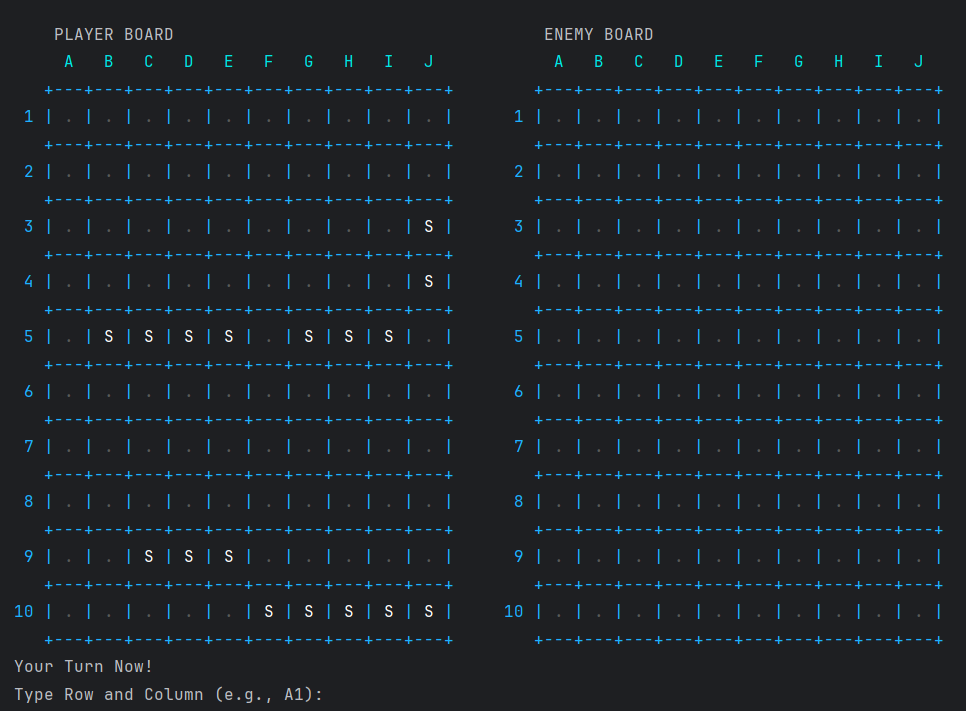

# 📄🛳️ Paper Battleship

**Paper Battleship** is a Java-based networked version of the classic Battleship game, built using socket programming. It simulates the nostalgic feel of the paper-based game, now with two players connecting over a network and taking turns to attack each other's grid.

## 🎯 Features

* Two-player turn-based gameplay over a network
* Server-client architecture using Java Sockets
* Console-based grid interaction
* Hit/miss feedback and ship sinking notification
* Simple and minimalistic design for learning and fun

## 🕹️ How to Play

1. **Start the Server**
   Run the `BattleShipServer` on one machine (or the host machine).

2. **Connect Two Clients**
   Run `BattleShipClient` on two separate terminals or machines. Each player enters the server's IP and port to connect.

3. **Gameplay**

    * Each player places their ships (can be manual or random depending on your implementation).
    * Players take turns entering grid coordinates like `A3`, `B7`, etc.
    * The game continues until one player sinks all of the opponent’s ships.



## 🚀 Getting Started

### Prerequisites

* Java 8 or higher
* Terminal or IDE (e.g., IntelliJ, Eclipse)


## 📁 Project Structure

```
PaperBattleShip/
├── java/
│   ├── Client/
│   │   ├── BattleShip.java
│   │   ├── BattleShipCell.java
│   │   ├── BattleShipClient.java
│   │   ├── BattleShipClientNetworkHandler.java
│   │   └── utils/
│   │       └── AnsiColor.java
│   └── Server/
│       ├── BattleShipServer.java
│       └── ClientHandler.java
